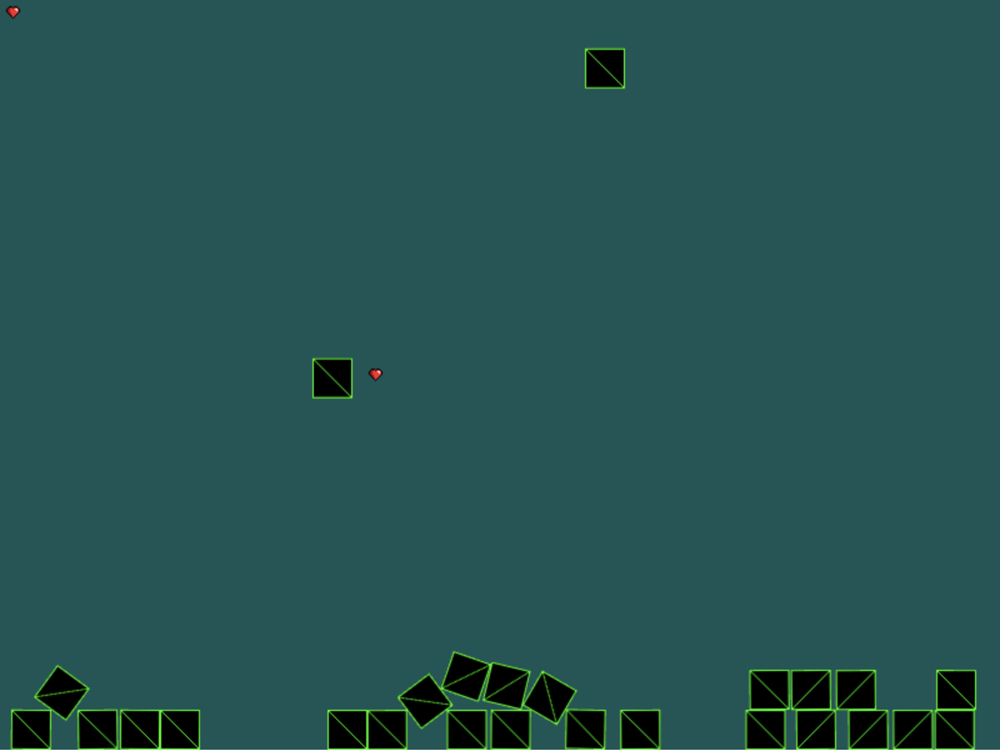
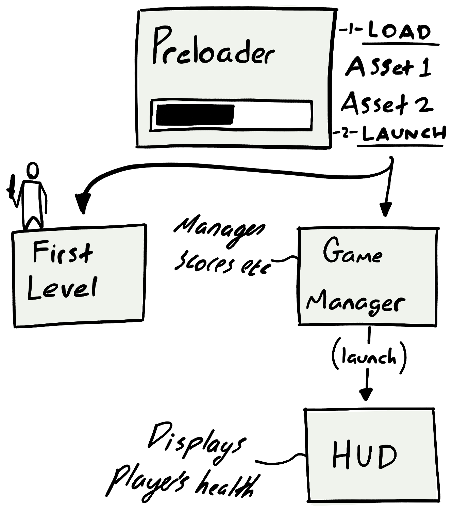
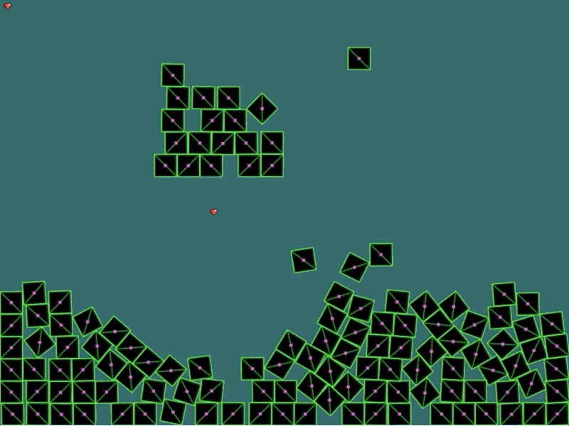

# Learning Journal

## 21nd Jan - An idea!


## 22nd Jan - Falling blocks!

Commit: 8ad9b60


I managed to setup Phaser3 with some blocks falling.

* Based it on the [Balls example](https://phaser.io/examples/v3/view/physics/matterjs/balls) 
* Learned about the Phaser Scene and how sprites are added to it

### Converted to TypeScript

I found it very difficult to find documentation for specific parameters/classes of Phaser3, so decided to use TypeScript.

1. First tried the [Roll.js based template](https://github.com/photonstorm/phaser3-typescript-project-template)
  * This was very slow when making changes, and I couldn't get WebStorm to debug
2. Doing some searching I came across the [phaser3-simple-rpg project](https://github.com/pierpo/phaser3-simple-rpg)
  * I used this template instead since it was quicker
  * Used the node moduleResolution so I didn't have to have the types directory 

## 27th Jan - Multiple Scenes

Commit: c9c3005



The [phaser3-simple-rpg project](https://github.com/pierpo/phaser3-simple-rpg) has helped me learn:
 
 * How you can have multiple scenes that are launched by the preloader
 * How objects interact via event callbacks
 * Patterns for layout and components of a game. e.g. having a GameManager to hold the state of the game (scores etc)



## 28th Jan - I have a rectangle!

Commit: ca067b0



I set out to create a yellow rectangle that will simulate a house in the eventual game just so I could play around
with how blocks interact. 

An hour later I'm still struggling to understand why my rectangle isn't visible?! I have at least learned that the 
`render` property relates to how the block will look in 'debug' mode.

**Code for adding a rectangle:**

```typescript
this.matter.add.rectangle(300, 300, 200, 100,
      {
        isStatic: true,
        ignoreGravity: true,
        render: {
          fillColor: 0xFF000,
          fillOpacity: 0,
          visible: true
        }
      }
    );
```

**Code for turning on debug mode**

```typescript
const config = {
      type: Phaser.AUTO,
      parent: 'game-container',
      backgroundColor: '#125555',
      width: 800,
      height: 600,
      physics: {
        default: 'matter',
        matter: {
          enableSleeping: true,
          debug: true,
          debugBodyColor: 0xffffff
        }
      },
      scene: [Preloader, Demo, GameManager, HUD]
    };
```

