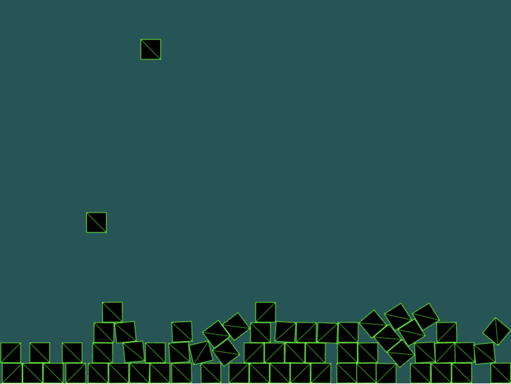

# Learning Journal

## 22nd Jan - Falling blocks!

Commit: 8ad9b60

I managed to setup Phaser3 with some blocks falling.

* Based it on the [Balls example](https://phaser.io/examples/v3/view/physics/matterjs/balls) 
* Learned about the Phaser Scene and how sprites are added to it

### Converted to TypeScript

I found it very difficult to find documentation for specific parameters/classes of Phaser3, so decided to use TypeScript.

1. First tried the [Roll.js based template](https://github.com/photonstorm/phaser3-typescript-project-template)
  * This was very slow when making changes, and I couldn't get WebStorm to debug
2. Doing some searching I came across the [phaser3-simple-rpg project](https://github.com/pierpo/phaser3-simple-rpg)
  * I used this template instead since it was quicker
  * Used the node moduleResolution so I didn't have to have the types directory 

## 27th Jan - Multiple Scenes

Commit: c9c3005

The [phaser3-simple-rpg project](https://github.com/pierpo/phaser3-simple-rpg) has helped me learn:
 
 * How you can have multiple scenes that are launched by the preloader
 * How objects interact via event callbacks
 * Patterns for layout and components of a game. e.g. having a GameManager to hold the state of the game (scores etc)
